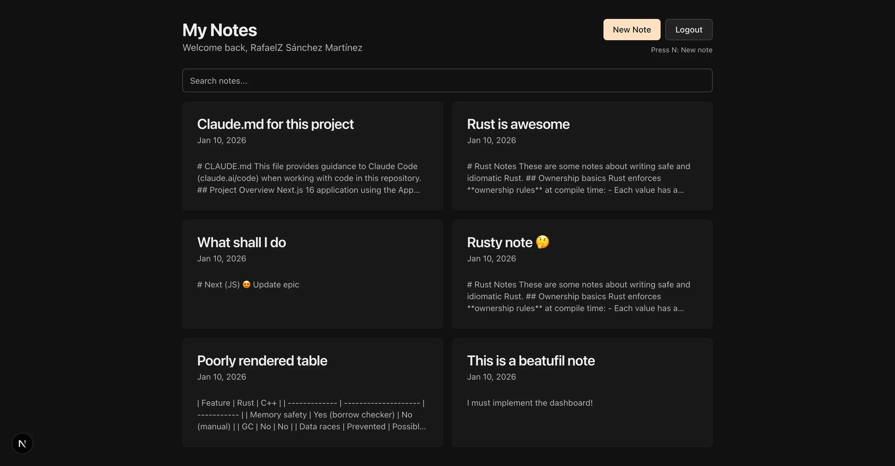
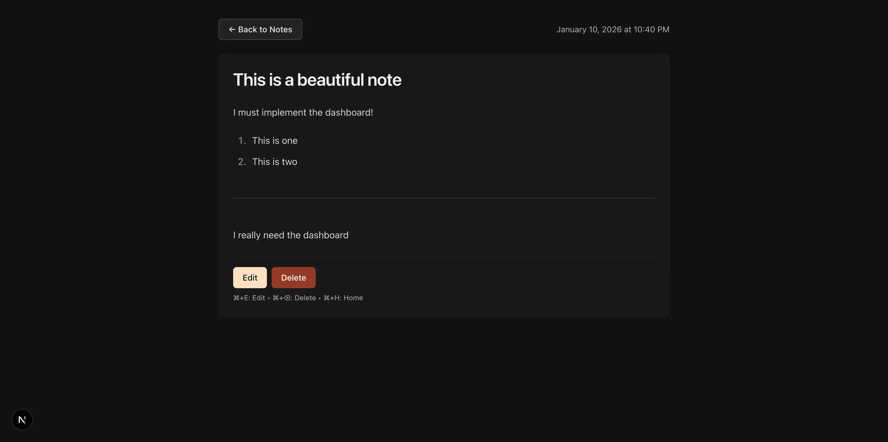
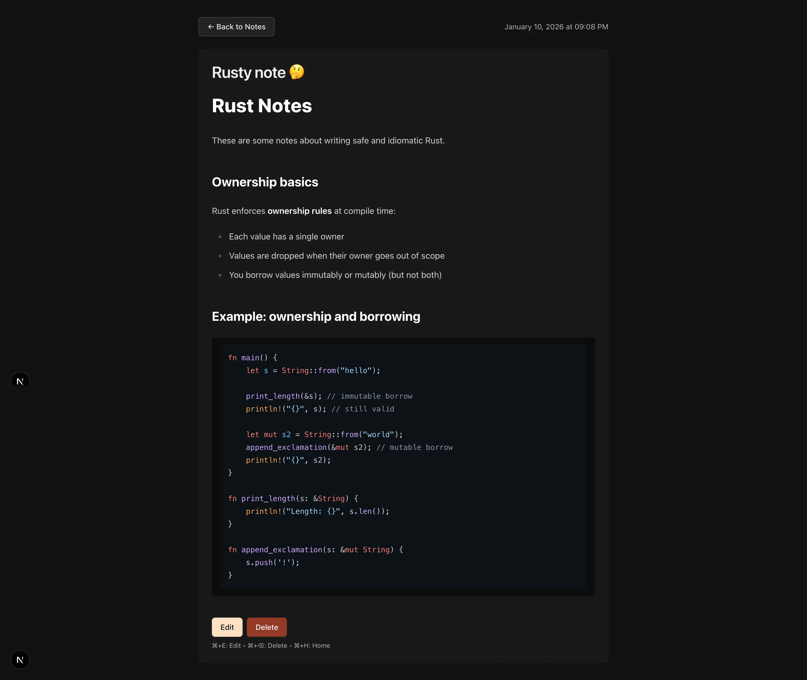

# Noxt

Yet another note-taking app.

## Overview

Awesome note-taking app built with Next.js.

### Tech Stack

- Next.js 16
- React 19
  - shadcn/ui
- TypeScript
- Tailwind 4
- Prisma with SQLite
- Bun

### Features

- Google OAuth
- Markdown editor with live preview
- Keyboard shortcuts
- Responsive design
- Note CRUD operations
- Note sorting
- Note search (Fuzzy Search with Fuse.js)

### Screenshots





## Getting Started

Clone the repository:

```bash
git clone https://github.com/ARKye03/noxt.git
```

Navigate to the project directory:

```bash
cd noxt
```

Install dependencies:

```bash
bun install
```

Set up environment variables:

In order to use Google OAuth, you need to set up environment variables, follow this [guide](https://developers.google.com/identity/protocols/oauth2) to get credentials. Use <http://localhost:3000/login/google/callback> as the redirect URI.

```bash
cp .env.example .env
```

Then paste your Google OAuth credentials in the `.env` file.

### Set up the database

Generate the Prisma Client:

```bash
bunx --bun prisma generate
```

Run database migrations to create the SQLite database and tables:

```bash
bunx --bun prisma migrate dev
```

### Run the development server

```bash
bun dev
```

Open [http://localhost:3000](http://localhost:3000) with your browser to see the result.

### Story

For work I had to use NextJS with shadcn and Prisma, the tech stack  is awesome on its own, so I wanted to try it out on my own project, instead using SQLite, and Lucia Auth. The cherry on top was using Bun instead of Node.js and [Tweakcn](https://tweakcn.com/) for the UI, which is awesome.
